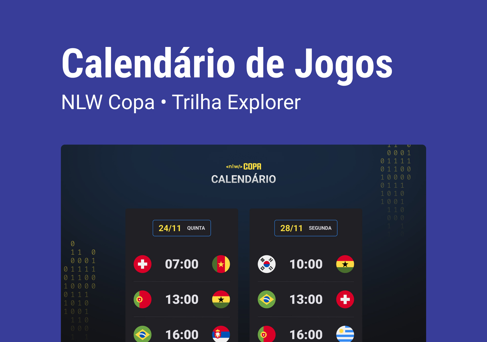

<h1 align="center"> NLW CALENDÁRIO DA COPA 2022</h1>

    Meu primeiro projeto junto com a rockseat, de um calendario da copa do mundo 2022

  <a href="#=tecnologias">Tecnologias</a> &nbsp;&nbsp;&nbsp;|&nbsp;&nbsp;&nbsp;
  <a href="#-projeto">Projeto</a> &nbsp;&nbsp;&nbsp;|&nbsp;&nbsp;&nbsp;
  <a href="#layout"> Layout</a>&nbsp;&nbsp;&nbsp;|&nbsp;&nbsp;&nbsp;
  <a href="#memo-licença">Licença</a>

  

 

    

## 🚀 Tecnologias

Esse projeto foi desenvolvido com as seguintes tecnologias:

- HTML e CSS
- JavaScript
- Git e GitHub

## 💻 Projeto

O calendario da copa e um projeto que mostra os jogos da copa 2022, de uma forma pessoal.

## 🔖 Layout

Você pode visualizar o layout do projeto através [desse link](https://www.figma.com/file/iW2Wn3q2MghLAtA9QJXgoB/Calend%C3%A1rio-de-Jogos-(Community)?node-id=301%3A1812). Lembrando que você precisa ter uma conta no [Figma](http://figma.com/) para acessá-lo.

## :memo: Licença

Esse projeto está sob a licença MIT. Veja o arquivo [LICENSE](LICENSE.md) para mais detalhes.

---

Feito com ♥ by Rocketseat :wave: [Participe da nossa comunidade!](https://discordapp.com/invite/gCRAFhc)